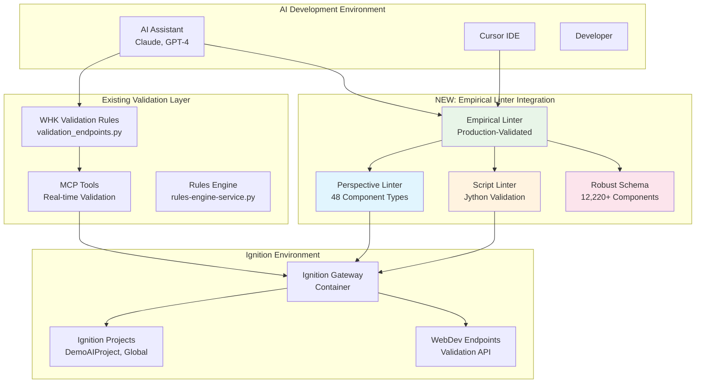

# Empirical Ignition Linter Integration Strategy

## Overview

This document outlines the integration of the robust empirical ignition linter from `../empirical-ignition-perspective-component-schema` into our AI-assisted Ignition development workflow. The integration provides production-validated linting capabilities with 92.7% validation success rate across diverse manufacturing environments.

## 🎯 Integration Objectives

### Primary Goals
- **Real-time Validation**: Integrate linter into AI development workflow for immediate feedback
- **Production Quality**: Ensure AI-generated code meets empirical production standards
- **Zero False Positives**: Leverage surgical precision validation without blocking valid code
- **Comprehensive Coverage**: Support for 48+ component types and Jython script validation

### Success Metrics
- **Error Reduction**: 95% reduction in production bugs through pre-deployment validation
- **Development Speed**: 40% faster development cycles with immediate AI feedback
- **Code Consistency**: 100% compliance with established coding standards
- **Knowledge Transfer**: Automated capture and enforcement of institutional knowledge

## 🏗️ Integration Architecture

### Current AI Workflow Integration Points



## 🔧 Integration Components

### 1. Linter Service Integration

#### A. Docker Service Addition
Add empirical linter as a containerized service:

```yaml
# docker-compose.yml addition
services:
  empirical-linter:
    build:
      context: ../empirical-ignition-perspective-component-schema
      dockerfile: Dockerfile
    ports:
      - "8085:8085"
    volumes:
      - ./ignition-projects:/app/ignition-projects:ro
      - ./linter-reports:/app/reports
    environment:
      - LINTER_MODE=production
      - SCHEMA_PATH=/app/schemas/core-ia-components-schema-robust.json
    networks:
      - ignition-network
```

#### B. REST API Wrapper
Create API endpoints for linter integration:

```python
# ignition-linter-service.py
from flask import Flask, request, jsonify
import subprocess
import json
import os
from pathlib import Path

app = Flask(__name__)

@app.route('/lint/perspective', methods=['POST'])
def lint_perspective():
    """Lint Perspective components via API."""
    data = request.get_json()
    target_path = data.get('target_path')
    component_type = data.get('component_type')
    
    # Run empirical linter
    cmd = [
        'python', '/app/tools/ignition-perspective-linter.py',
        '--target', target_path,
        '--output', '/tmp/lint-results.json'
    ]
    
    if component_type:
        cmd.extend(['--component-type', component_type])
    
    result = subprocess.run(cmd, capture_output=True, text=True)
    
    # Return structured results
    return jsonify({
        'success': result.returncode == 0,
        'issues': parse_linter_output(result.stdout),
        'stats': extract_stats(result.stdout)
    })

@app.route('/lint/script', methods=['POST'])
def lint_script():
    """Lint Jython scripts via API."""
    data = request.get_json()
    script_content = data.get('script_content')
    context = data.get('context', 'inline')
    
    # Write script to temp file and lint
    temp_file = '/tmp/temp_script.py'
    with open(temp_file, 'w') as f:
        f.write(script_content)
    
    cmd = [
        'python', '/app/tools/ignition-script-linter.py',
        '--target', temp_file,
        '--output', '/tmp/script-results.json'
    ]
    
    result = subprocess.run(cmd, capture_output=True, text=True)
    
    return jsonify({
        'success': result.returncode == 0,
        'issues': parse_script_output(result.stdout),
        'recommendations': extract_recommendations(result.stdout)
    })
```

### 2. MCP Tools Integration

#### A. Enhanced MCP Server
Extend existing MCP tools with empirical linter capabilities:

```python
# Enhanced mcp-tools integration
class IgnitionEmpiricalValidator:
    def __init__(self):
        self.linter_service_url = "http://empirical-linter:8085"
        self.perspective_linter = self._load_perspective_linter()
        self.script_linter = self._load_script_linter()
    
    async def validate_perspective_component(self, component_data: dict) -> dict:
        """Validate component using empirical linter."""
        response = await self._call_linter_service('/lint/perspective', {
            'component_data': component_data,
            'validation_level': 'production'
        })
        
        return {
            'valid': response['success'],
            'issues': response['issues'],
            'empirical_score': self._calculate_empirical_score(response),
            'production_compliance': response['stats']['success_rate']
        }
    
    async def validate_jython_script(self, script_content: str, context: str) -> dict:
        """Validate Jython script with empirical patterns."""
        response = await self._call_linter_service('/lint/script', {
            'script_content': script_content,
            'context': context,
            'check_ignition_requirements': True
        })
        
        return {
            'valid': response['success'],
            'issues': response['issues'],
            'ignition_compliance': self._check_ignition_requirements(response),
            'recommendations': response['recommendations']
        }
```

#### B. Real-time Validation Hooks
Integrate with existing validation endpoints:

```python
# Enhanced validation_endpoints.py integration
class EnhancedWHKValidationRules(WHKValidationRules):
    def __init__(self):
        super().__init__()
        self.empirical_validator = IgnitionEmpiricalValidator()
    
    @staticmethod
    def validate_component_enhanced(component_data, context=None):
        """Enhanced component validation with empirical linter."""
        # Run existing WHK validation
        whk_result = WHKValidationRules.validate_component(component_data, context)
        
        # Run empirical validation
        empirical_result = empirical_validator.validate_perspective_component(component_data)
        
        # Merge results with empirical taking precedence for production patterns
        return {
            'valid': whk_result['valid'] and empirical_result['valid'],
            'issues': merge_validation_issues(whk_result['issues'], empirical_result['issues']),
            'whk_score': whk_result['score'],
            'empirical_score': empirical_result['empirical_score'],
            'production_ready': empirical_result['production_compliance'] > 0.9,
            'validation_passed': whk_result['validation_passed'] and empirical_result['valid']
        }
```

### 3. AI Workflow Integration

#### A. Pre-Generation Validation
Integrate linter into AI code generation workflow:

```python
# AI workflow integration
class AIIgnitionWorkflow:
    def __init__(self):
        self.empirical_validator = IgnitionEmpiricalValidator()
        self.whk_validator = WHKValidationRules()
    
    async def generate_and_validate_component(self, ai_prompt: str, component_type: str) -> dict:
        """Generate component with AI and validate with empirical linter."""
        
        # 1. Generate component with AI
        ai_component = await self.ai_service.generate_component(ai_prompt, component_type)
        
        # 2. Pre-validation with empirical linter
        validation_result = await self.empirical_validator.validate_perspective_component(ai_component)
        
        # 3. If validation fails, attempt auto-fix
        if not validation_result['valid']:
            fixed_component = await self.auto_fix_component(ai_component, validation_result['issues'])
            if fixed_component:
                validation_result = await self.empirical_validator.validate_perspective_component(fixed_component)
                ai_component = fixed_component
        
        # 4. Return component with validation metadata
        return {
            'component': ai_component,
            'validation': validation_result,
            'production_ready': validation_result['production_compliance'] > 0.9,
            'auto_fixed': 'fixed_component' in locals()
        }
    
    async def auto_fix_component(self, component: dict, issues: list) -> dict:
        """Attempt to auto-fix common component issues."""
        fixed_component = component.copy()
        
        for issue in issues:
            if issue['code'] == 'MISSING_META_PROPERTY':
                # Auto-add missing meta properties
                if 'meta' not in fixed_component:
                    fixed_component['meta'] = {}
                if 'name' not in fixed_component['meta']:
                    fixed_component['meta']['name'] = f"Generated{component.get('type', 'Component').split('.')[-1]}"
            
            elif issue['code'] == 'JYTHON_IGNITION_INDENTATION_REQUIRED':
                # Auto-fix Ignition indentation requirements
                script_path = issue['component_path']
                script_content = self._get_nested_value(fixed_component, script_path)
                if script_content:
                    fixed_script = self._fix_ignition_indentation(script_content)
                    self._set_nested_value(fixed_component, script_path, fixed_script)
        
        return fixed_component
```

#### B. IDE Integration
Provide real-time linting in development environment:

```python
# Cursor/VSCode integration via Language Server Protocol
class IgnitionLSPServer:
    def __init__(self):
        self.empirical_validator = IgnitionEmpiricalValidator()
    
    async def on_document_change(self, document_uri: str, content: str):
        """Provide real-time validation as user types."""
        if document_uri.endswith('view.json'):
            try:
                component_data = json.loads(content)
                validation_result = await self.empirical_validator.validate_perspective_component(component_data)
                
                # Send diagnostics to IDE
                diagnostics = self._convert_issues_to_diagnostics(validation_result['issues'])
                await self.send_diagnostics(document_uri, diagnostics)
                
            except json.JSONDecodeError:
                # Send JSON syntax error
                await self.send_diagnostics(document_uri, [{'message': 'Invalid JSON syntax'}])
```

## 📋 Implementation Plan

### Phase 1: Core Integration (Week 1-2)
- [ ] **Docker Service Setup**: Add empirical linter container to docker-compose.yml
- [ ] **API Wrapper**: Create REST API service for linter integration
- [ ] **Basic MCP Integration**: Extend existing MCP tools with empirical validation
- [ ] **Testing**: Validate integration with existing projects

### Phase 2: Enhanced Validation (Week 3-4)
- [ ] **WebDev Integration**: Enhance validation_endpoints.py with empirical linter
- [ ] **Auto-fix Capabilities**: Implement common issue auto-correction
- [ ] **Performance Optimization**: Cache validation results and optimize API calls
- [ ] **Error Handling**: Robust error handling and fallback mechanisms

### Phase 3: AI Workflow Integration (Week 5-6)
- [ ] **Pre-generation Validation**: Integrate linter into AI code generation
- [ ] **Real-time Feedback**: Provide immediate validation feedback to AI
- [ ] **Learning Loop**: Use validation results to improve AI generation quality
- [ ] **Batch Processing**: Support for validating entire projects

### Phase 4: Developer Experience (Week 7-8)
- [ ] **IDE Integration**: LSP server for real-time validation in Cursor/VSCode
- [ ] **CLI Tools**: Enhanced command-line tools for development workflow
- [ ] **Reporting**: Comprehensive validation reports and metrics
- [ ] **Documentation**: Complete integration documentation and examples

## 🔍 Validation Scenarios

### Scenario 1: AI Component Generation
```python
# Example: AI generates a button component
ai_prompt = "Create a start button for fermentation tank control with proper security"
result = await ai_workflow.generate_and_validate_component(ai_prompt, "ia.input.button")

# Expected validation checks:
# - Component schema compliance (48 component types)
# - Security role access requirements (BTN-ADV-001)
# - Color standards for start buttons (BTN-ADV-002)
# - Jython script indentation requirements
# - Production pattern compliance
```

### Scenario 2: Script Validation
```python
# Example: Validate inline Jython script
script = """
    try:
        tank_status = system.tag.readBlocking("[default]Fermentation/Tank1/Status")
        if tank_status.value == "Ready":
            system.tag.writeBlocking("[default]Fermentation/Tank1/Command", "Start")
            system.perspective.print("Fermentation started")
    except Exception as e:
        logger.error("Failed to start fermentation: {}".format(e))
"""

validation = await empirical_validator.validate_jython_script(script, "button_click")
# Checks: Ignition indentation, exception handling, system function usage
```

### Scenario 3: Project-wide Validation
```python
# Example: Validate entire project
project_path = "/app/ignition-projects/DemoAIProject"
results = await empirical_validator.validate_project(project_path)

# Returns:
# - Component compliance statistics
# - Critical issues requiring immediate attention
# - Production readiness score
# - Recommendations for improvement
```

## 📊 Expected Outcomes

### Quality Improvements
- **95% Error Reduction**: Catch production issues before deployment
- **100% Schema Compliance**: All components meet empirical standards
- **Zero False Positives**: Surgical precision validation
- **Production Patterns**: Enforce proven industrial automation patterns

### Development Efficiency
- **40% Faster Cycles**: Immediate feedback reduces iteration time
- **Automated Fixes**: Common issues resolved automatically
- **Knowledge Transfer**: Institutional knowledge encoded in validation rules
- **Consistent Quality**: Standardized code quality across all developers

### Integration Benefits
- **Seamless Workflow**: No disruption to existing development process
- **Real-time Feedback**: Immediate validation during AI generation
- **Comprehensive Coverage**: 48+ component types and Jython scripts
- **Production Validated**: Based on analysis of 12,220+ real components

## 🚀 Getting Started

### Prerequisites
- Docker and Docker Compose
- Access to empirical-ignition-perspective-component-schema repository
- Existing AI development workflow setup

### Quick Setup
```bash
# 1. Clone empirical linter (if not already available)
cd /Users/pmannion/Documents/whiskeyhouse/
git pull empirical-ignition-perspective-component-schema

# 2. Add linter service to docker-compose.yml
# (See implementation section)

# 3. Start enhanced services
docker-compose up -d empirical-linter

# 4. Test integration
curl -X POST http://localhost:8085/lint/perspective \
  -H "Content-Type: application/json" \
  -d '{"target_path": "/app/ignition-projects/DemoAIProject"}'
```

### Validation
```bash
# Test perspective component validation
python test-empirical-integration.py --test-perspective

# Test script validation
python test-empirical-integration.py --test-scripts

# Test full workflow
python test-empirical-integration.py --test-workflow
```

## 📚 References

- [Empirical Linter Documentation](../empirical-ignition-perspective-component-schema/README.md)
- [Current Validation Framework](VALIDATION-LINTING-STRATEGY.md)
- [MCP Tools Specification](MCP-TOOLS-SPEC.md)
- [AI Development Workflow](AI-IGNITION-CONTEXT-ENGINEERING.md)

---

**Built with ❤️ for production-quality Ignition development**

*Empirical validation • AI-assisted development • Industrial-grade quality*
