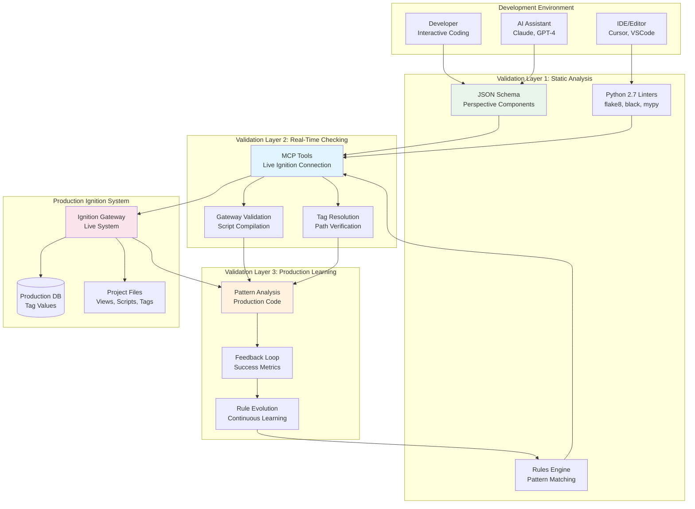

# Validation & Linting Strategy for Ignition Development

## Overview

This document outlines a comprehensive validation and linting strategy specifically designed for Ignition SCADA/HMI development. Since Ignition lacks native linting tools (particularly for Perspective JSON components), we implement a multi-layered approach that combines custom validation engines, real-time checking, and production pattern learning to ensure AI-generated code meets enterprise standards.

## 🎯 Strategic Objectives

### Primary Goals
- **Pre-Production Quality Assurance**: Catch errors before code reaches production systems
- **Standards Enforcement**: Ensure compliance with Ignition best practices and company-specific conventions
- **Real-Time Feedback**: Provide immediate validation during development workflows
- **Pattern Learning**: Continuously improve validation based on production code analysis
- **Performance Optimization**: Identify and prevent performance bottlenecks early

### Success Metrics
- **Error Reduction**: 95% reduction in production bugs related to code quality
- **Development Speed**: 40% faster development cycles through immediate feedback
- **Code Consistency**: 100% compliance with established coding standards
- **Knowledge Transfer**: Automated capture and enforcement of institutional knowledge

## 🏗️ Multi-Layered Validation Architecture

### Architecture Overview



## 📋 Layer 1: Static Analysis & Schema Validation

### 1.1 Perspective Component JSON Schema Validation

#### Component Schema Structure

```yaml
# schemas/perspective-components.yaml
perspective_component_schemas:
  base_component:
    type: object
    required: [type, props]
    properties:
      type:
        type: string
        description: "Component type identifier"
      props:
        type: object
        description: "Component properties"
      position:
        type: object
        description: "Layout positioning"
      meta:
        type: object
        description: "Component metadata"
      events:
        type: object
        description: "Event handlers"
        
  button_component:
    allOf:
      - $ref: "#/perspective_component_schemas/base_component"
      - type: object
        properties:
          type:
            const: "ia.display.button"
          props:
            type: object
            required: [text]
            properties:
              text:
                type: string
                minLength: 1
                maxLength: 100
                description: "Button display text"
              enabled:
                type: boolean
                default: true
                description: "Button enabled state"
              style:
                type: object
                properties:
                  backgroundColor:
                    type: string
                    pattern: "^(var\\(--[a-zA-Z0-9-]+\\)|#[0-9A-Fa-f]{6})$"
                    description: "Use theme variables or valid hex colors"
                  color:
                    type: string
                    pattern: "^(var\\(--[a-zA-Z0-9-]+\\)|#[0-9A-Fa-f]{6})$"
                  fontSize:
                    type: string
                    pattern: "^\\d+(px|em|rem|%)$"
            additionalProperties: false
          events:
            type: object
            properties:
              onActionPerformed:
                type: object
                properties:
                  config:
                    type: object
                    properties:
                      script:
                        type: string
                        description: "Jython script for button action"
                        
  numeric_entry_component:
    allOf:
      - $ref: "#/perspective_component_schemas/base_component"
      - type: object
        properties:
          type:
            const: "ia.input.numeric-entry-field"
          props:
            type: object
            required: [value]
            properties:
              value:
                type: number
                description: "Current numeric value"
              minValue:
                type: number
                description: "Minimum allowed value"
              maxValue:
                type: number
                description: "Maximum allowed value"
              format:
                type: string
                pattern: "^[0-9#.,]+$"
                description: "Number format pattern"
              readOnly:
                type: boolean
                default: false
              
  table_component:
    allOf:
      - $ref: "#/perspective_component_schemas/base_component"
      - type: object
        properties:
          type:
            const: "ia.display.table"
          props:
            type: object
            required: [data]
            properties:
              data:
                oneOf:
                  - type: array
                    description: "Direct data array"
                  - type: object
                    description: "Data binding configuration"
                    properties:
                      binding:
                        type: object
                        required: [type, config]
                        properties:
                          type:
                            enum: [tag, property, expression, transform]
                          config:
                            type: object
              columns:
                type: array
                items:
                  type: object
                  required: [field, header]
                  properties:
                    field:
                      type: string
                      description: "Data field name"
                    header:
                      type: string
                      description: "Column header text"
                    width:
                      type: number
                      minimum: 50
                      description: "Column width in pixels"
                    editable:
                      type: boolean
                      default: false
```

#### Schema Validation Implementation

```python
# validation/schema_validator.py
import jsonschema
import yaml
from typing import Dict, List, Any, Optional
from pathlib import Path

class PerspectiveSchemaValidator:
    def __init__(self, schema_directory: str):
        self.schema_directory = Path(schema_directory)
        self.schemas = {}
        self._load_schemas()
    
    def _load_schemas(self):
        """Load all component schemas from YAML files"""
        for schema_file in self.schema_directory.glob("*.yaml"):
            with open(schema_file, 'r', encoding='utf-8') as f:
                schema_data = yaml.safe_load(f)
                
            # Extract schemas from the file
            if 'perspective_component_schemas' in schema_data:
                self.schemas.update(schema_data['perspective_component_schemas'])
    
    def validate_component(self, component: Dict[str, Any]) -> Dict[str, Any]:
        """Validate a Perspective component against its schema"""
        result = {
            'valid': False,
            'errors': [],
            'warnings': [],
            'suggestions': []
        }
        
        try:
            component_type = component.get('type', '')
            
            # Determine schema to use
            schema_name = self._get_schema_name(component_type)
            if schema_name not in self.schemas:
                result['errors'].append({
                    'message': f"No schema found for component type: {component_type}",
                    'path': 'type',
                    'severity': 'error'
                })
                return result
            
            # Validate against schema
            schema = self.schemas[schema_name]
            validator = jsonschema.Draft7Validator(schema)
            
            errors = list(validator.iter_errors(component))
            if errors:
                for error in errors:
                    result['errors'].append({
                        'message': error.message,
                        'path': '.'.join(str(p) for p in error.absolute_path),
                        'severity': 'error',
                        'schema_path': '.'.join(str(p) for p in error.schema_path)
                    })
            else:
                result['valid'] = True
            
            # Additional validations
            self._validate_binding_expressions(component, result)
            self._validate_security_requirements(component, result)
            self._validate_performance_implications(component, result)
            
        except Exception as e:
            result['errors'].append({
                'message': f"Schema validation failed: {str(e)}",
                'path': '',
                'severity': 'error'
            })
        
        return result
    
    def _get_schema_name(self, component_type: str) -> str:
        """Map component type to schema name"""
        type_mapping = {
            'ia.display.button': 'button_component',
            'ia.input.numeric-entry-field': 'numeric_entry_component',
            'ia.display.table': 'table_component',
            'ia.display.label': 'label_component',
            'ia.chart.timeseries': 'timeseries_chart_component'
        }
        
        return type_mapping.get(component_type, 'base_component')
    
    def _validate_binding_expressions(self, component: Dict, result: Dict):
        """Validate binding expressions within component"""
        bindings = self._extract_bindings(component)
        
        for binding in bindings:
            if binding['type'] == 'expression':
                # Check for common expression issues
                expr = binding.get('config', {}).get('expression', '')
                
                if '{' in expr and '}' in expr:
                    # Expression binding
                    if expr.count('{') != expr.count('}'):
                        result['errors'].append({
                            'message': 'Unmatched braces in expression binding',
                            'path': binding['path'],
                            'severity': 'error'
                        })
                
                # Check for performance issues
                if '+' in expr and 'tag(' in expr:
                    result['warnings'].append({
                        'message': 'String concatenation in tag binding may impact performance',
                        'path': binding['path'],
                        'severity': 'warning',
                        'suggestion': 'Consider using indirect tag binding'
                    })
    
    def _validate_security_requirements(self, component: Dict, result: Dict):
        """Validate security-related requirements"""
        component_type = component.get('type', '')
        
        # Control components should have security configuration
        control_components = [
            'ia.input.numeric-entry-field',
            'ia.display.button',
            'ia.input.text-field'
        ]
        
        if component_type in control_components:
            # Check for role-based access
            meta = component.get('meta', {})
            if 'security' not in meta:
                result['warnings'].append({
                    'message': 'Control component should have security roles configured',
                    'path': 'meta.security',
                    'severity': 'warning',
                    'suggestion': 'Add security roles for production control components'
                })
    
    def _validate_performance_implications(self, component: Dict, result: Dict):
        """Check for performance-related issues"""
        # Check binding frequency
        bindings = self._extract_bindings(component)
        high_frequency_bindings = [b for b in bindings if 
                                 b.get('config', {}).get('polling', 'subscribe') != 'subscribe']
        
        if len(high_frequency_bindings) > 5:
            result['warnings'].append({
                'message': 'Multiple high-frequency bindings may impact performance',
                'path': 'props',
                'severity': 'warning',
                'suggestion': 'Consider using subscription-based bindings where possible'
            })
        
        # Check table row limits
        if component.get('type') == 'ia.display.table':
            data = component.get('props', {}).get('data', {})
            if isinstance(data, list) and len(data) > 1000:
                result['warnings'].append({
                    'message': 'Large table datasets may impact rendering performance',
                    'path': 'props.data',
                    'severity': 'warning',
                    'suggestion': 'Consider implementing pagination or virtual scrolling'
                })
    
    def _extract_bindings(self, component: Dict) -> List[Dict]:
        """Extract all bindings from component recursively"""
        bindings = []
        
        def extract_recursive(obj, path=""):
            if isinstance(obj, dict):
                if 'binding' in obj and isinstance(obj['binding'], dict):
                    binding = obj['binding'].copy()
                    binding['path'] = path
                    bindings.append(binding)
                
                for key, value in obj.items():
                    new_path = f"{path}.{key}" if path else key
                    extract_recursive(value, new_path)
            elif isinstance(obj, list):
                for i, item in enumerate(obj):
                    new_path = f"{path}[{i}]" if path else f"[{i}]"
                    extract_recursive(item, new_path)
        
        extract_recursive(component)
        return bindings
```

### 1.2 Jython Script Static Analysis

#### Python 2.7 Compatible Linting Configuration

```ini
# .flake8
[flake8]
max-line-length = 100
ignore = 
    # Ignore Python 3 specific warnings
    W503,  # line break before binary operator
    E203,  # whitespace before ':'
    F401,  # module imported but unused (common in Ignition)
exclude = 
    .git,
    __pycache__,
    .venv,
    build,
    dist
per-file-ignores =
    # Ignition scripts often have specific imports
    **/script-python/**/*.py: F401

# Ignition-specific configuration
filename = *.py
select = E,W,F,C
```

```yaml
# pyproject.toml equivalent for black (Python 2.7 mode)
[tool.black]
line-length = 100
target-version = ['py27']
include = '\.pyi?$'
extend-exclude = '''
/(
  # Exclude auto-generated files
  generated/
  | build/
  | dist/
)/
'''
```

#### Custom Jython AST Analyzer

```python
# validation/jython_analyzer.py
import ast
import re
from typing import Dict, List, Any, Optional, Set
from dataclasses import dataclass

@dataclass
class AnalysisIssue:
    line_number: int
    column: int
    severity: str  # error, warning, info
    message: str
    rule_id: str
    suggested_fix: Optional[str] = None

class IgnitionJythonAnalyzer:
    def __init__(self):
        self.ignition_functions = self._load_ignition_api()
        self.context_functions = self._load_context_functions()
        
    def analyze_script(self, script: str, context: str = 'gateway') -> Dict[str, Any]:
        """Analyze Jython script for Ignition compatibility"""
        result = {
            'syntax_valid': False,
            'issues': [],
            'metrics': {},
            'suggestions': []
        }
        
        try:
            # Parse AST
            tree = ast.parse(script)
            result['syntax_valid'] = True
            
            # Run analysis passes
            self._analyze_imports(tree, script, context, result)
            self._analyze_function_calls(tree, script, context, result)
            self._analyze_error_handling(tree, script, result)
            self._analyze_logging_usage(tree, script, result)
            self._analyze_performance_patterns(tree, script, result)
            self._analyze_security_patterns(tree, script, result)
            
            # Calculate metrics
            self._calculate_metrics(tree, script, result)
            
        except SyntaxError as e:
            result['issues'].append(AnalysisIssue(
                line_number=e.lineno or 0,
                column=e.offset or 0,
                severity='error',
                message=f"Syntax error: {e.msg}",
                rule_id='SYNTAX_ERROR',
                suggested_fix='Fix Python syntax error'
            ))
        except Exception as e:
            result['issues'].append(AnalysisIssue(
                line_number=0,
                column=0,
                severity='error',
                message=f"Analysis failed: {str(e)}",
                rule_id='ANALYSIS_ERROR'
            ))
        
        return result
    
    def _analyze_imports(self, tree: ast.AST, script: str, context: str, result: Dict):
        """Analyze import statements for Ignition compatibility"""
        for node in ast.walk(tree):
            if isinstance(node, ast.Import):
                for alias in node.names:
                    self._check_import_availability(alias.name, context, node.lineno, result)
            
            elif isinstance(node, ast.ImportFrom):
                module = node.module or ''
                
                # Check for wildcard imports from system module
                if module == 'system' and any(alias.name == '*' for alias in node.names):
                    result['issues'].append(AnalysisIssue(
                        line_number=node.lineno,
                        column=node.col_offset,
                        severity='warning',
                        message='Avoid wildcard imports from system module',
                        rule_id='WILDCARD_IMPORT',
                        suggested_fix='Import specific functions: from system.tag import readBlocking'
                    ))
                
                # Check availability of imported functions
                for alias in node.names:
                    full_name = f"{module}.{alias.name}" if module else alias.name
                    self._check_import_availability(full_name, context, node.lineno, result)
    
    def _analyze_function_calls(self, tree: ast.AST, script: str, context: str, result: Dict):
        """Analyze function calls for context appropriateness"""
        for node in ast.walk(tree):
            if isinstance(node, ast.Call):
                func_name = self._get_function_name(node.func)
                
                if func_name:
                    # Check if function is available in context
                    if func_name.startswith('system.'):
                        if not self._is_function_available(func_name, context):
                            result['issues'].append(AnalysisIssue(
                                line_number=node.lineno,
                                column=node.col_offset,
                                severity='error',
                                message=f"Function {func_name} not available in {context} context",
                                rule_id='FUNCTION_CONTEXT',
                                suggested_fix=f"Use alternative function for {context} context"
                            ))
                    
                    # Check for deprecated functions
                    if func_name in self._get_deprecated_functions():
                        alternative = self._get_function_alternative(func_name)
                        result['issues'].append(AnalysisIssue(
                            line_number=node.lineno,
                            column=node.col_offset,
                            severity='warning',
                            message=f"Function {func_name} is deprecated",
                            rule_id='DEPRECATED_FUNCTION',
                            suggested_fix=f"Use {alternative} instead"
                        ))
                    
                    # Check for performance anti-patterns
                    self._check_performance_patterns(node, func_name, result)
    
    def _analyze_error_handling(self, tree: ast.AST, script: str, result: Dict):
        """Analyze error handling patterns"""
        # Find try-except blocks
        try_blocks = [node for node in ast.walk(tree) if isinstance(node, ast.Try)]
        
        # Find risky operations (tag reads/writes, database operations)
        risky_operations = []
        for node in ast.walk(tree):
            if isinstance(node, ast.Call):
                func_name = self._get_function_name(node.func)
                if func_name and any(risk in func_name for risk in 
                                   ['tag.read', 'tag.write', 'db.run', 'db.exec']):
                    risky_operations.append(node)
        
        # Check if risky operations are in try blocks
        for op in risky_operations:
            if not self._is_in_try_block(op, try_blocks):
                result['issues'].append(AnalysisIssue(
                    line_number=op.lineno,
                    column=op.col_offset,
                    severity='warning',
                    message='Risky operation should be wrapped in try-except block',
                    rule_id='MISSING_ERROR_HANDLING',
                    suggested_fix='Add try-except block around operation'
                ))
        
        # Check try blocks have appropriate exception handling
        for try_block in try_blocks:
            if not try_block.handlers:
                result['issues'].append(AnalysisIssue(
                    line_number=try_block.lineno,
                    column=try_block.col_offset,
                    severity='error',
                    message='Try block without exception handlers',
                    rule_id='EMPTY_TRY',
                    suggested_fix='Add except clause to handle exceptions'
                ))
    
    def _analyze_logging_usage(self, tree: ast.AST, script: str, result: Dict):
        """Analyze logging patterns"""
        has_logger = False
        has_print_statements = False
        
        for node in ast.walk(tree):
            if isinstance(node, ast.Call):
                func_name = self._get_function_name(node.func)
                
                if func_name == 'system.util.getLogger':
                    has_logger = True
                elif func_name == 'print':
                    has_print_statements = True
                    # Check if print is used for error messages
                    if node.args and isinstance(node.args[0], ast.Str):
                        text = node.args[0].s.lower()
                        if any(word in text for word in ['error', 'fail', 'exception']):
                            result['issues'].append(AnalysisIssue(
                                line_number=node.lineno,
                                column=node.col_offset,
                                severity='warning',
                                message='Use system logger instead of print for error messages',
                                rule_id='PRINT_FOR_ERRORS',
                                suggested_fix='logger = system.util.getLogger("ScriptName"); logger.error("message")'
                            ))
        
        if has_print_statements and not has_logger:
            result['suggestions'].append({
                'type': 'best_practice',
                'message': 'Consider using system logger for better debugging and monitoring',
                'example': 'logger = system.util.getLogger("MyScript")'
            })
    
    def _check_performance_patterns(self, node: ast.Call, func_name: str, result: Dict):
        """Check for performance anti-patterns"""
        # Check for individual tag reads in loops
        if func_name in ['system.tag.read', 'system.tag.readBlocking']:
            # Check if this call is inside a loop
            parent = getattr(node, 'parent', None)
            while parent:
                if isinstance(parent, (ast.For, ast.While)):
                    result['issues'].append(AnalysisIssue(
                        line_number=node.lineno,
                        column=node.col_offset,
                        severity='warning',
                        message='Tag reads inside loops can impact performance',
                        rule_id='TAG_READ_IN_LOOP',
                        suggested_fix='Batch tag reads outside loop using readBlocking(tagList)'
                    ))
                    break
                parent = getattr(parent, 'parent', None)
    
    def _calculate_metrics(self, tree: ast.AST, script: str, result: Dict):
        """Calculate code quality metrics"""
        lines = script.split('\n')
        
        result['metrics'] = {
            'lines_of_code': len([line for line in lines if line.strip() and not line.strip().startswith('#')]),
            'total_lines': len(lines),
            'comment_ratio': len([line for line in lines if line.strip().startswith('#')]) / len(lines) if lines else 0,
            'cyclomatic_complexity': self._calculate_complexity(tree),
            'function_count': len([node for node in ast.walk(tree) if isinstance(node, ast.FunctionDef)]),
            'import_count': len([node for node in ast.walk(tree) if isinstance(node, (ast.Import, ast.ImportFrom))]),
            'system_function_calls': len([node for node in ast.walk(tree) 
                                        if isinstance(node, ast.Call) and 
                                        self._get_function_name(node.func, '').startswith('system.')])
        }
    
    def _load_ignition_api(self) -> Set[str]:
        """Load available Ignition API functions"""
        # This would be loaded from ignition-api package or documentation
        return {
            'system.tag.read', 'system.tag.readBlocking', 'system.tag.write', 'system.tag.writeBlocking',
            'system.db.runQuery', 'system.db.runUpdateQuery', 'system.db.runPrepQuery',
            'system.util.getLogger', 'system.util.sendMessage', 'system.util.invokeAsynchronous',
            'system.security.getUsername', 'system.security.getUserRoles',
            'system.date.now', 'system.date.format', 'system.date.parse'
        }
    
    def _load_context_functions(self) -> Dict[str, Set[str]]:
        """Load functions available in different contexts"""
        return {
            'gateway': self.ignition_functions,
            'client': self.ignition_functions - {'system.tag.writeBlocking'},  # Example restriction
            'perspective': self.ignition_functions - {'system.gui.*'},  # No Vision functions
            'designer': self.ignition_functions.union({'system.designer.*'})
        }
```

## 📡 Layer 2: Real-Time MCP Validation

### 2.1 Live Component Validation

The MCP tools provide real-time validation by connecting directly to Ignition gateways:

#### Enhanced Component Validator

```typescript
// Enhanced from existing MCP tools specification
export class EnhancedPerspectiveValidator extends PerspectiveComponentValidator {
  
  async validateWithLiveSystem(component: any, context: any): Promise<ValidationResult> {
    const results = await super.execute({ component, context, validation_level: 'production' });
    
    // Additional live validations
    await this.validateAgainstLiveGateway(component, results);
    await this.performRuntimeTests(component, context, results);
    await this.checkResourceUsage(component, results);
    
    return results;
  }
  
  private async validateAgainstLiveGateway(component: any, results: ValidationResult): Promise<void> {
    try {
      // Test component instantiation
      const testResult = await this.ignitionClient.testComponentInstantiation(component);
      
      if (!testResult.success) {
        results.errors.push({
          severity: 'error',
          message: `Component instantiation failed: ${testResult.error}`,
          property_path: '',
          suggested_fix: 'Review component configuration and property types'
        });
      }
      
      // Validate property bindings against live tags
      const bindings = this.extractBindings(component);
      for (const binding of bindings) {
        if (binding.type === 'tag') {
          const tagExists = await this.ignitionClient.verifyTagExists(binding.config.path);
          if (!tagExists) {
            results.errors.push({
              severity: 'error',
              message: `Tag not found: ${binding.config.path}`,
              property_path: binding.propertyPath,
              suggested_fix: 'Verify tag path exists in current project'
            });
          }
        }
      }
      
    } catch (error) {
      results.errors.push({
        severity: 'warning',
        message: `Live validation unavailable: ${error.message}`,
        property_path: '',
        suggested_fix: 'Ensure Ignition gateway is accessible'
      });
    }
  }
}
```

### 2.2 Script Compilation Testing

```typescript
// Real-time Jython script validation
export class LiveJythonValidator {
  constructor(private ignitionClient: IgnitionGatewayClient) {}
  
  async validateScript(script: string, context: ExecutionContext): Promise<ValidationResult> {
    const result: ValidationResult = {
      compilation_successful: false,
      runtime_issues: [],
      performance_metrics: {},
      suggestions: []
    };
    
    try {
      // Test compilation in Ignition's Jython engine
      const compilationResult = await this.ignitionClient.compileScript(script, context);
      result.compilation_successful = compilationResult.success;
      
      if (!compilationResult.success) {
        result.runtime_issues.push({
          type: 'compilation_error',
          message: compilationResult.error,
          line_number: compilationResult.lineNumber,
          suggested_fix: this.suggestCompilationFix(compilationResult.error)
        });
        return result;
      }
      
      // Test with sample data if available
      if (context.test_data) {
        const testResult = await this.ignitionClient.executeScriptTest(script, context.test_data);
        
        if (testResult.execution_time > 5000) { // 5 seconds
          result.suggestions.push({
            type: 'performance',
            message: 'Script execution time is high',
            suggested_optimization: 'Consider optimizing database queries or tag operations'
          });
        }
        
        result.performance_metrics = {
          execution_time: testResult.execution_time,
          memory_usage: testResult.memory_usage,
          tag_operations: testResult.tag_operations_count
        };
      }
      
      // Validate against current system state
      await this.validateSystemReferences(script, result);
      
    } catch (error) {
      result.runtime_issues.push({
        type: 'validation_error',
        message: `Validation failed: ${error.message}`,
        line_number: 0,
        suggested_fix: 'Check network connectivity to Ignition gateway'
      });
    }
    
    return result;
  }
  
  private async validateSystemReferences(script: string, result: ValidationResult): Promise<void> {
    // Extract tag references
    const tagReferences = this.extractTagReferences(script);
    
    for (const tagRef of tagReferences) {
      try {
        const tagInfo = await this.ignitionClient.getTagInfo(tagRef.path);
        
        if (!tagInfo.exists) {
          result.runtime_issues.push({
            type: 'missing_tag',
            message: `Tag does not exist: ${tagRef.path}`,
            line_number: tagRef.lineNumber,
            suggested_fix: `Create tag or use existing tag path`
          });
        } else if (!tagInfo.readable) {
          result.runtime_issues.push({
            type: 'access_denied',
            message: `No read access to tag: ${tagRef.path}`,
            line_number: tagRef.lineNumber,
            suggested_fix: 'Check security configuration for tag access'
          });
        }
        
        // Check data type compatibility
        if (tagRef.expectedType && tagInfo.dataType !== tagRef.expectedType) {
          result.suggestions.push({
            type: 'type_mismatch',
            message: `Type mismatch for tag ${tagRef.path}: expected ${tagRef.expectedType}, got ${tagInfo.dataType}`,
            suggested_fix: 'Add type conversion or use correct tag'
          });
        }
        
      } catch (error) {
        // Tag validation failed - add as warning
        result.suggestions.push({
          type: 'validation_warning',
          message: `Could not validate tag ${tagRef.path}: ${error.message}`
        });
      }
    }
  }
}
```

## 🎯 Layer 3: Production Pattern Learning

### 3.1 Pattern Extraction and Analysis

```python
# learning/pattern_extractor.py
from typing import Dict, List, Any, Set
import ast
import json
import re
from collections import defaultdict, Counter
from dataclasses import dataclass

@dataclass
class CodePattern:
    pattern_type: str
    pattern_id: str
    frequency: int
    confidence: float
    context: Dict[str, Any]
    examples: List[str]
    success_rate: float

class ProductionPatternLearner:
    def __init__(self, production_codebase_path: str):
        self.codebase_path = production_codebase_path
        self.patterns = defaultdict(list)
        self.anti_patterns = defaultdict(list)
        self.success_metrics = {}
        
    def analyze_production_codebase(self) -> Dict[str, List[CodePattern]]:
        """Analyze production code to extract successful patterns"""
        patterns = {
            'perspective_components': [],
            'jython_scripts': [],
            'tag_configurations': [],
            'binding_expressions': []
        }
        
        # Analyze different code types
        self._analyze_perspective_patterns(patterns)
        self._analyze_jython_patterns(patterns)
        self._analyze_tag_patterns(patterns)
        self._analyze_binding_patterns(patterns)
        
        # Score patterns based on usage and success
        self._score_patterns(patterns)
        
        return patterns
    
    def _analyze_perspective_patterns(self, patterns: Dict):
        """Extract patterns from Perspective component configurations"""
        component_files = self._find_perspective_files()
        
        component_usage = Counter()
        property_patterns = defaultdict(Counter)
        event_patterns = defaultdict(Counter)
        
        for file_path in component_files:
            try:
                with open(file_path, 'r', encoding='utf-8') as f:
                    component_data = json.load(f)
                
                if 'type' in component_data:
                    comp_type = component_data['type']
                    component_usage[comp_type] += 1
                    
                    # Analyze property patterns
                    if 'props' in component_data:
                        for prop_name, prop_value in component_data['props'].items():
                            pattern_key = f"{comp_type}.{prop_name}"
                            if isinstance(prop_value, dict) and 'binding' in prop_value:
                                # Binding pattern
                                binding_type = prop_value['binding'].get('type', 'unknown')
                                property_patterns[pattern_key][f"binding:{binding_type}"] += 1
                            else:
                                # Direct value pattern
                                value_type = type(prop_value).__name__
                                property_patterns[pattern_key][f"value:{value_type}"] += 1
                    
                    # Analyze event patterns
                    if 'events' in component_data:
                        for event_name, event_config in component_data['events'].items():
                            pattern_key = f"{comp_type}.{event_name}"
                            if isinstance(event_config, dict) and 'config' in event_config:
                                script = event_config['config'].get('script', '')
                                if script:
                                    # Analyze script patterns
                                    script_patterns = self._extract_script_patterns(script)
                                    for pattern in script_patterns:
                                        event_patterns[pattern_key][pattern] += 1
                        
            except Exception as e:
                print(f"Error analyzing {file_path}: {e}")
                continue
        
        # Convert to pattern objects
        for comp_type, count in component_usage.most_common(20):
            patterns['perspective_components'].append(CodePattern(
                pattern_type='component_usage',
                pattern_id=comp_type,
                frequency=count,
                confidence=self._calculate_confidence(count, len(component_files)),
                context={'component_type': comp_type},
                examples=self._get_component_examples(comp_type),
                success_rate=self._get_success_rate(comp_type)
            ))
    
    def _analyze_jython_patterns(self, patterns: Dict):
        """Extract patterns from Jython scripts"""
        script_files = self._find_jython_scripts()
        
        function_patterns = Counter()
        import_patterns = Counter()
        error_handling_patterns = Counter()
        
        for file_path in script_files:
            try:
                with open(file_path, 'r', encoding='utf-8') as f:
                    script_content = f.read()
                
                # Parse AST
                tree = ast.parse(script_content)
                
                # Extract function call patterns
                for node in ast.walk(tree):
                    if isinstance(node, ast.Call):
                        func_name = self._get_function_name(node.func)
                        if func_name and func_name.startswith('system.'):
                            function_patterns[func_name] += 1
                    
                    elif isinstance(node, ast.ImportFrom):
                        module = node.module or ''
                        for alias in node.names:
                            import_pattern = f"{module}.{alias.name}"
                            import_patterns[import_pattern] += 1
                    
                    elif isinstance(node, ast.Try):
                        # Analyze error handling patterns
                        handler_types = []
                        for handler in node.handlers:
                            if handler.type:
                                handler_types.append(ast.dump(handler.type))
                        
                        pattern = "try:" + ",".join(handler_types)
                        error_handling_patterns[pattern] += 1
                        
            except Exception as e:
                print(f"Error analyzing script {file_path}: {e}")
                continue
        
        # Convert to pattern objects
        for func_name, count in function_patterns.most_common(30):
            patterns['jython_scripts'].append(CodePattern(
                pattern_type='function_usage',
                pattern_id=func_name,
                frequency=count,
                confidence=self._calculate_confidence(count, len(script_files)),
                context={'function_name': func_name, 'category': 'system_function'},
                examples=self._get_function_examples(func_name),
                success_rate=self._get_function_success_rate(func_name)
            ))
    
    def _score_patterns(self, patterns: Dict):
        """Score patterns based on frequency, success rate, and production stability"""
        for pattern_category, pattern_list in patterns.items():
            for pattern in pattern_list:
                # Base score from frequency and confidence
                base_score = (pattern.frequency * pattern.confidence) / 100
                
                # Adjust for success rate
                success_adjustment = pattern.success_rate * 0.5
                
                # Adjust for pattern maturity (how long it's been in production)
                maturity_score = self._get_pattern_maturity(pattern.pattern_id)
                
                # Final score
                pattern.confidence = min(1.0, base_score + success_adjustment + maturity_score)
    
    def extract_anti_patterns(self) -> Dict[str, List[CodePattern]]:
        """Extract anti-patterns from problematic code"""
        # Analyze git history for reverted changes
        problematic_patterns = self._analyze_git_reverts()
        
        # Analyze performance issues
        performance_issues = self._analyze_performance_logs()
        
        # Analyze support tickets and bug reports
        bug_patterns = self._analyze_bug_reports()
        
        return {
            'reverted_patterns': problematic_patterns,
            'performance_issues': performance_issues,
            'bug_patterns': bug_patterns
        }
    
    def generate_validation_rules(self, patterns: Dict[str, List[CodePattern]]) -> Dict[str, Any]:
        """Generate validation rules from learned patterns"""
        rules = {
            'positive_patterns': {},
            'anti_patterns': {},
            'best_practices': {}
        }
        
        # Generate positive pattern rules
        for category, pattern_list in patterns.items():
            high_confidence_patterns = [p for p in pattern_list if p.confidence > 0.8]
            
            rules['positive_patterns'][category] = [
                {
                    'pattern_id': p.pattern_id,
                    'weight': p.confidence,
                    'examples': p.examples[:3],  # Top 3 examples
                    'context': p.context
                }
                for p in high_confidence_patterns[:10]  # Top 10 patterns
            ]
        
        # Generate anti-pattern rules
        anti_patterns = self.extract_anti_patterns()
        for category, anti_pattern_list in anti_patterns.items():
            rules['anti_patterns'][category] = [
                {
                    'pattern': ap.pattern_id,
                    'severity': 'error' if ap.confidence > 0.7 else 'warning',
                    'message': f"Anti-pattern detected: {ap.pattern_id}",
                    'examples': ap.examples
                }
                for ap in anti_pattern_list if ap.confidence > 0.5
            ]
        
        return rules
```

### 3.2 Continuous Learning Pipeline

```python
# learning/continuous_learner.py
import schedule
import time
from datetime import datetime, timedelta
from typing import Dict, List, Any

class ContinuousLearningPipeline:
    def __init__(self, 
                 git_monitor: 'GitChangeMonitor',
                 pattern_learner: ProductionPatternLearner,
                 validation_engine: 'ValidationEngine'):
        self.git_monitor = git_monitor
        self.pattern_learner = pattern_learner
        self.validation_engine = validation_engine
        self.learning_history = []
        
    def setup_learning_schedule(self):
        """Setup automated learning schedule"""
        # Daily pattern analysis
        schedule.every().day.at("02:00").do(self.daily_pattern_analysis)
        
        # Weekly comprehensive analysis
        schedule.every().sunday.at("01:00").do(self.weekly_comprehensive_analysis)
        
        # Real-time change monitoring
        schedule.every(10).minutes.do(self.monitor_recent_changes)
        
        # Monthly rule optimization
        schedule.every().month.do(self.monthly_rule_optimization)
    
    def daily_pattern_analysis(self):
        """Daily analysis of new code patterns"""
        print(f"Starting daily pattern analysis: {datetime.now()}")
        
        try:
            # Get changes from last 24 hours
            recent_changes = self.git_monitor.get_changes_since(
                datetime.now() - timedelta(days=1)
            )
            
            if not recent_changes:
                print("No recent changes to analyze")
                return
            
            # Analyze new patterns
            new_patterns = self.pattern_learner.analyze_changes(recent_changes)
            
            # Update validation rules if significant patterns found
            if self._has_significant_patterns(new_patterns):
                self._update_validation_rules(new_patterns)
                print(f"Updated validation rules with {len(new_patterns)} new patterns")
            
            # Log learning session
            self.learning_history.append({
                'timestamp': datetime.now(),
                'type': 'daily_analysis',
                'changes_analyzed': len(recent_changes),
                'patterns_found': len(new_patterns),
                'rules_updated': self._has_significant_patterns(new_patterns)
            })
            
        except Exception as e:
            print(f"Daily pattern analysis failed: {e}")
    
    def weekly_comprehensive_analysis(self):
        """Weekly comprehensive codebase analysis"""
        print(f"Starting weekly comprehensive analysis: {datetime.now()}")
        
        try:
            # Full codebase analysis
            all_patterns = self.pattern_learner.analyze_production_codebase()
            
            # Performance trend analysis
            performance_trends = self._analyze_performance_trends()
            
            # Rule effectiveness analysis
            rule_effectiveness = self._analyze_rule_effectiveness()
            
            # Generate recommendations
            recommendations = self._generate_learning_recommendations(
                all_patterns, performance_trends, rule_effectiveness
            )
            
            # Apply recommendations
            self._apply_recommendations(recommendations)
            
            print(f"Weekly analysis complete. Applied {len(recommendations)} recommendations")
            
        except Exception as e:
            print(f"Weekly analysis failed: {e}")
    
    def monitor_recent_changes(self):
        """Monitor and analyze very recent changes"""
        try:
            # Get changes from last 10 minutes
            very_recent = self.git_monitor.get_changes_since(
                datetime.now() - timedelta(minutes=10)
            )
            
            for change in very_recent:
                # Quick pattern analysis for immediate feedback
                if self._is_high_impact_change(change):
                    pattern_analysis = self.pattern_learner.quick_analyze(change)
                    
                    if pattern_analysis.get('potential_issues'):
                        # Send immediate feedback
                        self._send_immediate_feedback(change, pattern_analysis)
                        
        except Exception as e:
            print(f"Recent change monitoring failed: {e}")
    
    def _analyze_rule_effectiveness(self) -> Dict[str, float]:
        """Analyze how effective current rules are"""
        effectiveness = {}
        
        # Get validation history
        validation_history = self.validation_engine.get_validation_history(
            since=datetime.now() - timedelta(weeks=1)
        )
        
        rule_performance = defaultdict(lambda: {'caught': 0, 'missed': 0, 'false_positive': 0})
        
        for validation in validation_history:
            for rule_result in validation.get('rule_results', []):
                rule_id = rule_result['rule_id']
                
                if rule_result['triggered']:
                    if validation.get('actual_issue_found'):
                        rule_performance[rule_id]['caught'] += 1
                    else:
                        rule_performance[rule_id]['false_positive'] += 1
                elif validation.get('actual_issue_found'):
                    rule_performance[rule_id]['missed'] += 1
        
        # Calculate effectiveness scores
        for rule_id, perf in rule_performance.items():
            total_issues = perf['caught'] + perf['missed']
            if total_issues > 0:
                accuracy = perf['caught'] / total_issues
                precision = perf['caught'] / (perf['caught'] + perf['false_positive']) if (perf['caught'] + perf['false_positive']) > 0 else 0
                effectiveness[rule_id] = (accuracy + precision) / 2
            else:
                effectiveness[rule_id] = 0.0
        
        return effectiveness
    
    def _generate_learning_recommendations(self, 
                                         patterns: Dict, 
                                         performance_trends: Dict, 
                                         rule_effectiveness: Dict) -> List[Dict]:
        """Generate learning-based recommendations"""
        recommendations = []
        
        # Recommend new rules for high-frequency patterns
        for category, pattern_list in patterns.items():
            high_freq_patterns = [p for p in pattern_list if p.frequency > 10 and p.confidence > 0.8]
            
            for pattern in high_freq_patterns:
                if not self._pattern_has_rule(pattern.pattern_id):
                    recommendations.append({
                        'type': 'new_rule',
                        'category': category,
                        'pattern': pattern,
                        'priority': 'high' if pattern.confidence > 0.9 else 'medium'
                    })
        
        # Recommend rule modifications for poor performers
        for rule_id, effectiveness in rule_effectiveness.items():
            if effectiveness < 0.5:
                recommendations.append({
                    'type': 'modify_rule',
                    'rule_id': rule_id,
                    'current_effectiveness': effectiveness,
                    'action': 'refine_conditions' if effectiveness < 0.3 else 'adjust_threshold'
                })
        
        # Recommend rule removal for very poor performers
        poor_rules = [rule_id for rule_id, eff in rule_effectiveness.items() if eff < 0.2]
        for rule_id in poor_rules:
            recommendations.append({
                'type': 'remove_rule',
                'rule_id': rule_id,
                'reason': 'consistently_poor_performance'
            })
        
        return recommendations
    
    def run_continuous_learning(self):
        """Start the continuous learning pipeline"""
        print("Starting continuous learning pipeline...")
        
        self.setup_learning_schedule()
        
        try:
            while True:
                schedule.run_pending()
                time.sleep(60)  # Check every minute
                
        except KeyboardInterrupt:
            print("Stopping continuous learning pipeline...")
        except Exception as e:
            print(f"Continuous learning pipeline error: {e}")
            # Restart after delay
            time.sleep(300)  # Wait 5 minutes before restart
            self.run_continuous_learning()
```

This comprehensive validation and linting strategy ensures that all AI-generated Ignition code meets production standards through multiple layers of analysis, real-time validation, and continuous learning from production patterns.